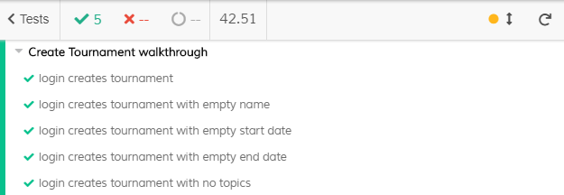

 ES20 P3 submission, Group 45

## Feature PPA

### Subgroup

 - Maria Sbrancia, ist178631, majos95
   + Issues assigned: [#145](https://github.com/tecnico-softeng/es20tg_45-project/issues/145), [#146](https://github.com/tecnico-softeng/es20tg_45-project/issues/146), [#148](https://github.com/tecnico-softeng/es20tg_45-project/issues/148), [#150](https://github.com/tecnico-softeng/es20tg_45-project/issues/150)
 - Diogo Lobato, ist190711, DiogoLobato
   + Issues assigned: [#153](https://github.com/tecnico-softeng/es20tg_45-project/issues/153), [#155](https://github.com/tecnico-softeng/es20tg_45-project/issues/155)
 
### Pull requests associated with this feature

The list of pull requests associated with this feature is:

 - [PR #144](https://github.com/tecnico-softeng/es20tg_45-project/pull/144)
 - [PR #147](https://github.com/tecnico-softeng/es20tg_45-project/pull/147)
 - [PR #149](https://github.com/tecnico-softeng/es20tg_45-project/pull/149)
 - [PR #151](https://github.com/tecnico-softeng/es20tg_45-project/pull/151)
 - [PR #159](https://github.com/tecnico-softeng/es20tg_45-project/pull/159)
 - [PR #160](https://github.com/tecnico-softeng/es20tg_45-project/pull/160)
 - [PR #177](https://github.com/tecnico-softeng/es20tg_45-project/pull/177)


### Frontend

#### New/Updated Views

 - [StudentView](https://github.com/tecnico-softeng/es20tg_45-project/blob/perguntas-por-alunos-dev/frontend/src/views/student/StudentView.vue)
 - [EditSubmittedQuestionDialog](https://github.com/tecnico-softeng/es20tg_45-project/blob/perguntas-por-alunos-dev/frontend/src/views/student/question/EditSubmittedQuestionDialog.vue)
 - [EditSubmittedQuestionTopics](https://github.com/tecnico-softeng/es20tg_45-project/blob/perguntas-por-alunos-dev/frontend/src/views/student/question/EditSubmittedQuestionTopics.vue)
 - [ShowSubmittedQuestion](https://github.com/tecnico-softeng/es20tg_45-project/blob/perguntas-por-alunos-dev/frontend/src/views/student/question/ShowSubmittedQuestion.vue)
 - [ShowSubmittedQuestionDialog](https://github.com/tecnico-softeng/es20tg_45-project/blob/perguntas-por-alunos-dev/frontend/src/views/student/question/ShowSubmittedQuestionDialog.vue)
 - [SubmittedQuestionView](https://github.com/tecnico-softeng/es20tg_45-project/blob/perguntas-por-alunos-dev/frontend/src/views/student/question/SubmittedQuestionsView.vue)
 
 - [EvaluateQuestionView](https://github.com/tecnico-softeng/es20tg_45-project/blob/perguntas-por-alunos-dev/frontend/src/views/teacher/evaluations/EvaluateQuestionsView.vue)
 - [EvaluateQuestionDialog](https://github.com/tecnico-softeng/es20tg_45-project/blob/perguntas-por-alunos-dev/frontend/src/views/teacher/evaluations/EvaluateQuestionDialog.vue)

#### New/Updated Models

 - [Evaluation](https://github.com/tecnico-softeng/es20tg_45-project/blob/perguntas-por-alunos-dev/frontend/src/models/management/Evaluation.ts)

### Additional services implemented

 - [findEvaluationByKey](https://github.com/tecnico-softeng/es20tg_45-project/blob/b2bf765018d59e0e63529a4e8ffafbac94a43a5a/backend/src/main/java/pt/ulisboa/tecnico/socialsoftware/tutor/evaluation/EvaluationService.java#L45)
    + [Controller](https://github.com/tecnico-softeng/es20tg_45-project/blob/b2bf765018d59e0e63529a4e8ffafbac94a43a5a/backend/src/main/java/pt/ulisboa/tecnico/socialsoftware/tutor/evaluation/EvaluationController.java#L24)

    Besides the added services, alterations were done on the following:

  - [submitEvaluation](https://github.com/tecnico-softeng/es20tg_45-project/blob/5bf73d401b074e5aaa503467c56d4b2ab99f8bc6/backend/src/main/java/pt/ulisboa/tecnico/socialsoftware/tutor/evaluation/EvaluationService.java#L57)
    + [Controller](https://github.com/tecnico-softeng/es20tg_45-project/blob/5bf73d401b074e5aaa503467c56d4b2ab99f8bc6/backend/src/main/java/pt/ulisboa/tecnico/socialsoftware/tutor/evaluation/EvaluationController.java#L24)
    + [SubmitEvaluationTest](https://github.com/tecnico-softeng/es20tg_45-project/blob/perguntas-por-alunos-dev/backend/src/test/groovy/pt/ulisboa/tecnico/socialsoftware/tutor/evaluation/service/SubmitEvaluationTest.groovy)
    + [SubmitEvaluationPerformanceTest](https://github.com/tecnico-softeng/es20tg_45-project/blob/perguntas-por-alunos-dev/backend/src/test/groovy/pt/ulisboa/tecnico/socialsoftware/tutor/evaluation/service/SubmitEvaluationPerformanceTest.groovy)
    + [WSSubmitEvaluationTest (JMeter)](https://github.com/tecnico-softeng/es20tg_45-project/blob/perguntas-por-alunos-dev/backend/jmeter/evaluation/WSSubmitEvaluationTest.jmx)
    + [WSSubmitEvaluationLoadTest (JMeter)](https://github.com/tecnico-softeng/es20tg_45-project/blob/perguntas-por-alunos-dev/backend/jmeter/evaluation/WSSubmitEvaluationLoadTest.jmx)


  - [submitQuestion](https://github.com/tecnico-softeng/es20tg_45-project/blob/5bf73d401b074e5aaa503467c56d4b2ab99f8bc6/backend/src/main/java/pt/ulisboa/tecnico/socialsoftware/tutor/question/QuestionService.java#L157)
    + [Controller](https://github.com/tecnico-softeng/es20tg_45-project/blob/5bf73d401b074e5aaa503467c56d4b2ab99f8bc6/backend/src/main/java/pt/ulisboa/tecnico/socialsoftware/tutor/question/api/QuestionController.java#L147)

  - [sortStudentSubmittedQuestionsByCreationDate](https://github.com/tecnico-softeng/es20tg_45-project/blob/5bf73d401b074e5aaa503467c56d4b2ab99f8bc6/backend/src/main/java/pt/ulisboa/tecnico/socialsoftware/tutor/question/QuestionService.java#L324)
    + [Controller](https://github.com/tecnico-softeng/es20tg_45-project/blob/5bf73d401b074e5aaa503467c56d4b2ab99f8bc6/backend/src/main/java/pt/ulisboa/tecnico/socialsoftware/tutor/question/api/QuestionController.java#L164)

  - [QuestionController](https://github.com/tecnico-softeng/es20tg_45-project/blob/perguntas-por-alunos-dev/backend/src/main/java/pt/ulisboa/tecnico/socialsoftware/tutor/question/api/QuestionController.java)
    + [updateQuestion] : added "or hasRole('ROLE_STUDENT')"
    + [removeQuestion] : added "or hasRole('ROLE_STUDENT')"
    + [uploadImage] : added "or hasRole('ROLE_STUDENT')"
    + [updateQuestionTopics] : added "or hasRole('ROLE_STUDENT')"

  - [TopicController](https://github.com/tecnico-softeng/es20tg_45-project/blob/perguntas-por-alunos-dev/backend/src/main/java/pt/ulisboa/tecnico/socialsoftware/tutor/question/api/TopicController.java)
      + [getCourseTopics] : added "or hasRole('ROLE_STUDENT')"
      + [createTopic] : added "or hasRole('ROLE_STUDENT')"
      + [updateTopic] : added "or hasRole('ROLE_STUDENT')"


### End-to-end tests

#### Created tests

 - [login creates and submits a question](https://github.com/tecnico-softeng/es20tg_45-project/blob/b2bf765018d59e0e63529a4e8ffafbac94a43a5a/frontend/tests/e2e/specs/student/studentSubmitsQuestion.js#L12)
 - [login creates one normal question and one faulty question](https://github.com/tecnico-softeng/es20tg_45-project/blob/b2bf765018d59e0e63529a4e8ffafbac94a43a5a/frontend/tests/e2e/specs/student/studentSubmitsQuestion.js#L21)
 - [submits two questions and checks if ordered](https://github.com/tecnico-softeng/es20tg_45-project/blob/b2bf765018d59e0e63529a4e8ffafbac94a43a5a/frontend/tests/e2e/specs/student/studentSubmitsQuestion.js#L39)
 - [approves Question](https://github.com/tecnico-softeng/es20tg_45-project/blob/be436de5f6cba54c1cc9bc6df4f843dff557d668/frontend/tests/e2e/specs/teacher/teacherSubmitEvaluation.js#L19)
 - [rejects Question](https://github.com/tecnico-softeng/es20tg_45-project/blob/be436de5f6cba54c1cc9bc6df4f843dff557d668/frontend/tests/e2e/specs/teacher/teacherSubmitEvaluation.js#L23)


#### Rationale
For the submitQuestion feature tests for the creation, deletion and the expected sorting in the view were created. For the submission of Evaluation an approval test and a rejection tests were created. 
MERGE!

#### Commands defined

 - [demoStudentLogin](https://github.com/tecnico-softeng/es20tg_45-project/blob/be436de5f6cba54c1cc9bc6df4f843dff557d668/frontend/tests/e2e/support/commands.js#L34)
 - [demoTeacherLogin](https://github.com/tecnico-softeng/es20tg_45-project/blob/be436de5f6cba54c1cc9bc6df4f843dff557d668/frontend/tests/e2e/support/commands.js#L40)
 - [submitQuestion](https://github.com/tecnico-softeng/es20tg_45-project/blob/5bf73d401b074e5aaa503467c56d4b2ab99f8bc6/frontend/tests/e2e/support/commands.js#L86)
 - [submitQuestionNoCorrect](https://github.com/tecnico-softeng/es20tg_45-project/blob/5bf73d401b074e5aaa503467c56d4b2ab99f8bc6/frontend/tests/e2e/support/commands.js#L98)
 - [deleteQuestion](https://github.com/tecnico-softeng/es20tg_45-project/blob/5bf73d401b074e5aaa503467c56d4b2ab99f8bc6/frontend/tests/e2e/support/commands.js#L110)
 - [checkOrderTwoQuestions](https://github.com/tecnico-softeng/es20tg_45-project/blob/5bf73d401b074e5aaa503467c56d4b2ab99f8bc6/frontend/tests/e2e/support/commands.js#L120)
 - [approveQuestion](https://github.com/tecnico-softeng/es20tg_45-project/blob/be436de5f6cba54c1cc9bc6df4f843dff557d668/frontend/tests/e2e/support/commands.js#L137)
 - [rejectQuestion](https://github.com/tecnico-softeng/es20tg_45-project/blob/be436de5f6cba54c1cc9bc6df4f843dff557d668/frontend/tests/e2e/support/commands.js#L151)


#### Screenshot of test results overview


## Feature DDP

### Subgroup
 - Pedro Moreira, ist190768, iScaryPT
   + Issues assigned: [#154](https://github.com/tecnico-softeng/es20tg_45-project/issues/154), [#157](https://github.com/tecnico-softeng/es20tg_45-project/issues/157), [#167](https://github.com/tecnico-softeng/es20tg_45-project/issues/167) 
 - Miguel Mota, ist190964, UnlimitedPugWorks
   + Issues assigned: [#160](https://github.com/tecnico-softeng/es20tg_45-project/issues/160), [#161](https://github.com/tecnico-softeng/es20tg_45-project/issues/161), [#163](https://github.com/tecnico-softeng/es20tg_45-project/issues/163), [#165](https://github.com/tecnico-softeng/es20tg_45-project/issues/165), [#166](https://github.com/tecnico-softeng/es20tg_45-project/issues/166)   
 
### Pull requests associated with this feature

The list of pull requests associated with this feature is:

 - [PR #175](https://github.com/tecnico-softeng/es20tg_45-project/pull/175)

### Frontend

#### New/Updated Views
 - [DoubtsView.vue](https://github.com/tecnico-softeng/es20tg_45-project/blob/discuss%C3%A3o-de-perguntas-dev/frontend/src/views/student/DoubtsView.vue)
 - [CreateDoubtDialog.vue](https://github.com/tecnico-softeng/es20tg_45-project/blob/discuss%C3%A3o-de-perguntas-dev/frontend/src/views/student/CreateDoubtDialog.vue)
 - [CreateClarificationDialog.vue](https://github.com/tecnico-softeng/es20tg_45-project/blob/discuss%C3%A3o-de-perguntas-dev/frontend/src/views/teacher/doubts/CreateClarificationDialog.vue)
 - [SolveDoubtsView.vue](https://github.com/tecnico-softeng/es20tg_45-project/blob/discuss%C3%A3o-de-perguntas-dev/frontend/src/views/teacher/doubts/SolveDoubtsView.vue)

#### New/Updated Models

 - [Doubt.ts](https://github.com/tecnico-softeng/es20tg_45-project/blob/discuss%C3%A3o-de-perguntas-dev/frontend/src/models/management/Doubt.ts)
 - [Clarification.ts](https://github.com/tecnico-softeng/es20tg_45-project/blob/discuss%C3%A3o-de-perguntas-dev/frontend/src/models/management/Clarification.ts)

### Additional services implemented

 - [findCourseExecutionDoubts](https://github.com/tecnico-softeng/es20tg_45-project/blob/discuss%C3%A3o-de-perguntas-dev/backend/src/main/java/pt/ulisboa/tecnico/socialsoftware/tutor/doubt/DoubtService.java#L111)
    + [Controller](https://github.com/tecnico-softeng/es20tg_45-project/blob/discuss%C3%A3o-de-perguntas-dev/backend/src/main/java/pt/ulisboa/tecnico/socialsoftware/tutor/doubt/DoubtController.java#L53)

 - [findQuizQuestionDoubts](https://github.com/tecnico-softeng/es20tg_45-project/blob/discuss%C3%A3o-de-perguntas-dev/backend/src/main/java/pt/ulisboa/tecnico/socialsoftware/tutor/doubt/DoubtService.java#L82)
    + [Controller](https://github.com/tecnico-softeng/es20tg_45-project/blob/discuss%C3%A3o-de-perguntas-dev/backend/src/main/java/pt/ulisboa/tecnico/socialsoftware/tutor/doubt/DoubtController.java#L45)

 - [findDoubtClarification](https://github.com/tecnico-softeng/es20tg_45-project/blob/discuss%C3%A3o-de-perguntas-dev/backend/src/main/java/pt/ulisboa/tecnico/socialsoftware/tutor/clarification/ClarificationService.java#L64)

 
### End-to-end tests

#### Created tests
 - [Login creates a doubt](https://github.com/tecnico-softeng/es20tg_45-project/blob/discuss%C3%A3o-de-perguntas-dev/frontend/tests/e2e/specs/student/manageDoubts.js#L12)
 - [Login creates two doubts in two different questions](https://github.com/tecnico-softeng/es20tg_45-project/blob/discuss%C3%A3o-de-perguntas-dev/frontend/tests/e2e/specs/student/manageDoubts.js#L17)
 - [Login creates an empty doubt](https://github.com/tecnico-softeng/es20tg_45-project/blob/discuss%C3%A3o-de-perguntas-dev/frontend/tests/e2e/specs/student/manageDoubts.js#L24)
 - [Login creates a doubt and see it on the doubt list](https://github.com/tecnico-softeng/es20tg_45-project/blob/discuss%C3%A3o-de-perguntas-dev/frontend/tests/e2e/specs/student/manageDoubtsList.js#L12)
 - [Login creates a clarification for a unsolved doubt](https://github.com/tecnico-softeng/es20tg_45-project/blob/discuss%C3%A3o-de-perguntas-dev/frontend/tests/e2e/specs/teacher/manageDoubts.js#L13)
 - [Login try to creates a clarification for a unsolved doubt without text](https://github.com/tecnico-softeng/es20tg_45-project/blob/discuss%C3%A3o-de-perguntas-dev/frontend/tests/e2e/specs/teacher/manageDoubts.js#L21)
 
 #### Rationale

It allowed us to push code without worrying about breaking things and with confidence. It also catches errors that are missed during manual testing.

#### Commands defined

 - [commands.js](https://github.com/tecnico-softeng/es20tg_45-project/blob/discuss%C3%A3o-de-perguntas-dev/frontend/tests/e2e/support/commands.js)

#### Screenshot of test results overview


## Feature TDP

### Subgroup

 - Nuno Palma, 86903, NunoPalma
   + Issues assigned: [#1](https://github.com/tecnico-softeng/es20tg_45-project/issues/139), [#2](https://github.com/tecnico-softeng/es20tg_45-project/issues/140), [#3](https://github.com/tecnico-softeng/es20tg_45-project/issues/141), [#4](https://github.com/tecnico-softeng/es20tg_45-project/issues/142), [#5](https://github.com/tecnico-softeng/es20tg_45-project/issues/162), [#6](https://github.com/tecnico-softeng/es20tg_45-project/issues/170)
 - João Caldeira, 88033, JTCaldeira
   + Issues assigned: [#7](https://github.com/tecnico-softeng/es20tg_45-project/issues/136), [#8](https://github.com/tecnico-softeng/es20tg_45-project/issues/137), [#9](https://github.com/tecnico-softeng/es20tg_45-project/issues/168)
 
### Pull requests associated with this feature

The list of pull requests associated with this feature is:

 - [PR #000](https://github.com/tecnico-softeng/es20tg_45-project/pull/169)
 - [PR #001](https://github.com/tecnico-softeng/es20tg_45-project/pull/138)
 - [PR #002](https://github.com/tecnico-softeng/es20tg_45-project/pull/156)
 - [PR #003](https://github.com/tecnico-softeng/es20tg_45-project/pull/174)
 - [PR #004](https://github.com/tecnico-softeng/es20tg_45-project/pull/176)

### Frontend

#### New/Updated Views

 - [TournamentsView.vue](https://github.com/tecnico-softeng/es20tg_45-project/blob/torneios-de-perguntas/frontend/src/views/student/TournamentsView.vue)
 - [EditTournamentDialog.vue](https://github.com/tecnico-softeng/es20tg_45-project/blob/torneios-de-perguntas/frontend/src/views/student/EditTournamentDialog.vue)


#### New/Updated Models
 - [Tournament.ts](https://github.com/tecnico-softeng/es20tg_45-project/blob/torneios-de-perguntas/frontend/src/models/management/Tournament.ts)

### End-to-end tests

#### Created tests

 - [Login creates tournament](https://github.com/tecnico-softeng/es20tg_45-project/blob/torneios-de-perguntas/frontend/tests/e2e/specs/tournament/createTournament.js)
 - [Login views tournaments list](https://github.com/tecnico-softeng/es20tg_45-project/blob/torneios-de-perguntas/frontend/tests/e2e/specs/tournament/viewTournamentsList.js)
 - [Login enroll student in tournament](https://github.com/tecnico-softeng/es20tg_45-project/blob/torneios-de-perguntas/frontend/tests/e2e/specs/tournament/enrollStudent.js)

#### Rationale
* ```createTournament:``` The first test is a successful case of a tournament creation, with all valid input. The other 4 tests each provide a different invalid input, upon whose receival an error should be thrown.
* ```viewTournamentsLost:``` Successful case where the user tries to access the tournaments page and views the list of available tournaments.
* ```enrollStudent:``` Successful case where the user tries to enroll in a certain tournament.


#### Commands defined

 - [commands.js](https://github.com/tecnico-softeng/es20tg_45-project/blob/torneios-de-perguntas/frontend/tests/e2e/support/commands.js)

#### Screenshot of test results overview



