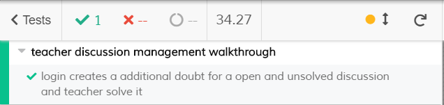

# ES20 P4 submission, Group 45

## Feature PPA

### Subgroup

 - Maria Sbrancia, ist178631, majos95
   + Issues assigned: [#192](https://github.com/tecnico-softeng/es20tg_45-project/issues/192), [#193](https://github.com/tecnico-softeng/es20tg_45-project/issues/193), [#194](https://github.com/tecnico-softeng/es20tg_45-project/issues/194), [#195](https://github.com/tecnico-softeng/es20tg_45-project/issues/195), [#202](https://github.com/tecnico-softeng/es20tg_45-project/issues/202), [#206](https://github.com/tecnico-softeng/es20tg_45-project/issues/206), [#223](https://github.com/tecnico-softeng/es20tg_45-project/issues/223), [#225](https://github.com/tecnico-softeng/es20tg_45-project/issues/225), [#234](https://github.com/tecnico-softeng/es20tg_45-project/issues/234), [#235](https://github.com/tecnico-softeng/es20tg_45-project/issues/235), [#236](https://github.com/tecnico-softeng/es20tg_45-project/issues/236), [#239](https://github.com/tecnico-softeng/es20tg_45-project/issues/239)
   + Tasks: F4:Service, F4:Spock Tests, F5:Service, F5:Spock Tests, F6:Service, F6:Spock Tests;
 - Diogo Lobato, ist190711, DiogoLobato
   + Issues assigned: [#201](https://github.com/tecnico-softeng/es20tg_45-project/issues/201), [#203](https://github.com/tecnico-softeng/es20tg_45-project/issues/203), [#207](https://github.com/tecnico-softeng/es20tg_45-project/issues/207), [#211](https://github.com/tecnico-softeng/es20tg_45-project/issues/211), [#231](https://github.com/tecnico-softeng/es20tg_45-project/issues/231), [#233](https://github.com/tecnico-softeng/es20tg_45-project/issues/233), [#248](https://github.com/tecnico-softeng/es20tg_45-project/issues/248), [#250](https://github.com/tecnico-softeng/es20tg_45-project/issues/250)
   + Tasks: F7:Service, F7:Spock Tests, F8:Service, F8:Spock Tests
 
### Pull requests associated with this feature

The list of pull requests associated with this feature is:

 - [PR #217](https://github.com/tecnico-softeng/es20tg_45-project/pull/217)
 - [PR #232](https://github.com/tecnico-softeng/es20tg_45-project/pull/232)
 - [PR #256](https://github.com/tecnico-softeng/es20tg_45-project/pull/256)

### Listed features
Below, we list **only** the implemented features. For each feature, we link the relevant files and we mark which requested parts are completed.

#### Feature number 4: _An approved question can become part of the set of available questions_

 - When a teacher goes to evaluate a question, he now has 2 options. Either he clicks on *Saves and Approves* which will make the question
 become a part of the set of *AVAILABLE* questions or he clicks on *Skip and Approve* which will approve a question but will become *DISABLED*.
 This is done on the frontend, on a new updated version of the EvaluateQuestionDialog using the same services of the last deliveries.
 It can be checked here:
 - [x] [Updated EvaluateQuestionDialog.vue](https://github.com/tecnico-softeng/es20tg_45-project/blob/perguntas-por-alunos-dev/frontend/src/views/teacher/evaluations/EvaluateQuestionDialog.vue)
 - [x] [Cypress use case test](https://github.com/tecnico-softeng/es20tg_45-project/blob/perguntas-por-alunos-dev/frontend/tests/e2e/specs/teacher/teacherSubmitEvaluation.js)
   + Screenshot: 
   
     

#### Feature number 5: _A teacher can change an approved question before putting it as part of the set of available questions_

 - In this feature, it was all done in frontend as well, while using methods and services that already existed. When a teacher, 
 while evaluating a question, clicks *Skip and Approve*, he basically approves the question but, while being *DISABLED*, the teacher
 can then edit the question at his will and then change it's status to *AVAILABLE* with the existing methods/services.
 We thought that this implementation would be much better in terms of work flow and more natural. It's all in the *Updated 
 EvaluateQuestionDialog.vue* of the above feature.
 
 - [x] [Cypress use case test](https://github.com/tecnico-softeng/es20tg_45-project/blob/perguntas-por-alunos-dev/frontend/tests/e2e/specs/teacher/teacherSubmitEvaluation.js)
   + Screenshot: 
   
     
   
#### Feature number 6: _A rejected question can be edited and resubmitted by the student_
 - [x] [Service](https://github.com/tecnico-softeng/es20tg_45-project/blob/06872132dc451b0563bf8ba02fc1a02f682adfdb/backend/src/main/java/pt/ulisboa/tecnico/socialsoftware/tutor/question/QuestionService.java#L187)
 - [x] [Spock tests](https://github.com/tecnico-softeng/es20tg_45-project/blob/perguntas-por-alunos-dev/backend/src/test/groovy/pt/ulisboa/tecnico/socialsoftware/tutor/question/service/ResubmitQuestionTest.groovy)
 - [x] [JMeter feature tests](https://github.com/tecnico-softeng/es20tg_45-project/blob/perguntas-por-alunos-dev/backend/jmeter/question/WSResubmitQuestion.jmx)
   + Screenshots:
      
     
     
 - [x] [Cypress use case test](https://github.com/tecnico-softeng/es20tg_45-project/blob/perguntas-por-alunos-dev/frontend/tests/e2e/specs/student/resubmitQuestion.js)
   + Screenshot: 
   
     

#### Feature number 7: _The information about a student's proposed and approved questions' number is on his dashboard_
 - [x] [Service](https://github.com/tecnico-softeng/es20tg_45-project/blob/06872132dc451b0563bf8ba02fc1a02f682adfdb/backend/src/main/java/pt/ulisboa/tecnico/socialsoftware/tutor/question/QuestionService.java#L363)
 - [x] [Spock tests](https://github.com/tecnico-softeng/es20tg_45-project/blob/perguntas-por-alunos-dev/backend/src/test/groovy/pt/ulisboa/tecnico/socialsoftware/tutor/question/service/CalculateApprovedVersusProposedTest.groovy)
 - [x] [JMeter feature tests](https://github.com/tecnico-softeng/es20tg_45-project/blob/perguntas-por-alunos-dev/backend/jmeter/question/WSStudentCalculateApprovedVSProposed.jmx)
   + Screenshots:
      
     
     
 - [x] [Cypress use case test](https://github.com/tecnico-softeng/es20tg_45-project/blob/perguntas-por-alunos-dev/frontend/tests/e2e/specs/student/calculateApprovedVSProposedQuestionsStats.js)
   + Screenshot: 
   
     

#### Feature number 8: _The student decides if that information on his dashboard should be public or private_
 - [x] [Service](https://github.com/tecnico-softeng/es20tg_45-project/blob/06872132dc451b0563bf8ba02fc1a02f682adfdb/backend/src/main/java/pt/ulisboa/tecnico/socialsoftware/tutor/user/UserService.java#L123)
 - [x] [Spock tests](https://github.com/tecnico-softeng/es20tg_45-project/blob/perguntas-por-alunos-dev/backend/src/test/groovy/pt/ulisboa/tecnico/socialsoftware/tutor/user/domain/user/TogglePrivacyTest.groovy)
 - [x] [JMeter feature tests](https://github.com/tecnico-softeng/es20tg_45-project/blob/perguntas-por-alunos-dev/backend/jmeter/student/WSTogglePrivacyTest.jmx)
   + Screenshots:
      
     
     
 - [x] [Cypress use case test](https://github.com/tecnico-softeng/es20tg_45-project/blob/perguntas-por-alunos-dev/frontend/tests/e2e/specs/student/toggleStatisticsPrivacy.js)
   + Screenshot: 
   
     

---

## Feature DDP

### Subgroup

 - Pedro Moreira, 90768, iScaryPT
   + Issues assigned: 
   [#210](https://github.com/tecnico-softeng/es20tg_45-project/issues/210)
   [#212](https://github.com/tecnico-softeng/es20tg_45-project/issues/212)
   [#213](https://github.com/tecnico-softeng/es20tg_45-project/issues/213)
   [#214](https://github.com/tecnico-softeng/es20tg_45-project/issues/214)
   [#215](https://github.com/tecnico-softeng/es20tg_45-project/issues/215)
   [#218](https://github.com/tecnico-softeng/es20tg_45-project/issues/218)
   [#226](https://github.com/tecnico-softeng/es20tg_45-project/issues/226)
   [#230](https://github.com/tecnico-softeng/es20tg_45-project/issues/230)
   [#238](https://github.com/tecnico-softeng/es20tg_45-project/issues/238)
   [#245](https://github.com/tecnico-softeng/es20tg_45-project/issues/245)
   [#246](https://github.com/tecnico-softeng/es20tg_45-project/issues/246)
   [#247](https://github.com/tecnico-softeng/es20tg_45-project/issues/247)
   [#262](https://github.com/tecnico-softeng/es20tg_45-project/issues/262)
   [#263](https://github.com/tecnico-softeng/es20tg_45-project/issues/263)
   [#264](https://github.com/tecnico-softeng/es20tg_45-project/issues/264)
   [#265](https://github.com/tecnico-softeng/es20tg_45-project/issues/265)
   [#266](https://github.com/tecnico-softeng/es20tg_45-project/issues/266)
   + Tasks: F1: FrontEnd Tests, F1:FrontEnd Page, F1:Web Service, F1:Jmeter Test,
   F2: FrontEnd Page, F2: Web Service, F2:Service, F2: Spock Tests,  F2:Jmeter Test
   F3: Jmeter Test,
   F6: FrontEnd Tests, F6: Jmeter Test, F6: Web Service,  F6:FrontEnd Page, F6: Service

   
  
 - Miguel Mota, 90964, UnlimitedPugWorks
   + Issues assigned:
   [#208](https://github.com/tecnico-softeng/es20tg_45-project/issues/208) ,
   [#237](https://github.com/tecnico-softeng/es20tg_45-project/issues/237),
   [#249](https://github.com/tecnico-softeng/es20tg_45-project/issues/249),
   [#260](https://github.com/tecnico-softeng/es20tg_45-project/issues/260),
   [#261](https://github.com/tecnico-softeng/es20tg_45-project/issues/261),
   [#270](https://github.com/tecnico-softeng/es20tg_45-project/issues/270),
   [#271](https://github.com/tecnico-softeng/es20tg_45-project/issues/271) 
   [#272](https://github.com/tecnico-softeng/es20tg_45-project/issues/272)
   [#273](https://github.com/tecnico-softeng/es20tg_45-project/issues/273)
   [#274](https://github.com/tecnico-softeng/es20tg_45-project/issues/274)
   [#275](https://github.com/tecnico-softeng/es20tg_45-project/issues/275)
   + Tasks: 
            F1:Refactor,
            F3:FrontEnd Page,
            F4:Routing, F4: FrontEnd Page,
            F5:Spock Test, F5:Service, F5:Web Service, F5:FrontEnd Page,
            F6:Spock Tests
            
 
### Pull requests associated with this feature

The list of pull requests associated with this feature is:

 - [PR#277](https://github.com/tecnico-softeng/es20tg_45-project/pull/277)

### Listed features

#### Feature number 1: O aluno pode pedir esclarecimentos adicionais_

 - [x] [Service](https://github.com/tecnico-softeng/es20tg_45-project/blob/discuss%C3%A3o-de-perguntas/backend/src/main/java/pt/ulisboa/tecnico/socialsoftware/tutor/doubt/DoubtService.java)
 - [x] [Spock tests](https://github.com/tecnico-softeng/es20tg_45-project/blob/discuss%C3%A3o-de-perguntas/backend/src/test/groovy/pt/ulisboa/tecnico/socialsoftware/tutor/doubt/service/AddDoubtTest.groovy)
 - [x] [JMeter feature tests](https://github.com/tecnico-softeng/es20tg_45-project/blob/discuss%C3%A3o-de-perguntas/backend/jmeter/doubt/WSaddDoubtDiscussionTest.jmx)
   + Screenshots:
      
     
     
 - [x] [Cypress use case test](https://github.com/tecnico-softeng/es20tg_45-project/blob/discuss%C3%A3o-de-perguntas/frontend/tests/e2e/specs/student/addAdditionalDoubttoDiscussion.js)
   + Screenshot: 
   
     

#### Feature number 2: O Docente pode tornar a questão e o seu esclarecimento disponivel para os outros alunos.

 - [x] [Service](https://github.com/tecnico-softeng/es20tg_45-project/blob/discuss%C3%A3o-de-perguntas/backend/src/main/java/pt/ulisboa/tecnico/socialsoftware/tutor/doubt/DoubtService.java)
 - [x] [Spock tests](https://github.com/tecnico-softeng/es20tg_45-project/blob/discuss%C3%A3o-de-perguntas/backend/src/test/groovy/pt/ulisboa/tecnico/socialsoftware/tutor/doubt/service/changeVisibilityTest.groovy)
 - [x] [JMeter feature tests](https://github.com/tecnico-softeng/es20tg_45-project/blob/discuss%C3%A3o-de-perguntas/backend/jmeter/doubt/WSchangeVisibilityTest.jmx)
   + Screenshots:
      
     
     
 - [x] [Cypress use case test](https://github.com/tecnico-softeng/es20tg_45-project/blob/discuss%C3%A3o-de-perguntas/frontend/tests/e2e/specs/teacher/changeDiscussionVisibility.js)
   + Screenshot: 
   
     

#### Feature number 3: Um aluno, após responder a uma pergunta, pode consultar, se existirem os pedidos de esclarecimento sobre essa pergunta e as repostas dadas

 - [x] [Service](https://github.com/tecnico-softeng/es20tg_45-project/blob/discuss%C3%A3o-de-perguntas/backend/src/main/java/pt/ulisboa/tecnico/socialsoftware/tutor/doubt/DoubtService.java)
 - [x] [Spock tests](https://github.com/tecnico-softeng/es20tg_45-project/blob/discuss%C3%A3o-de-perguntas/backend/src/test/groovy/pt/ulisboa/tecnico/socialsoftware/tutor/doubt/service/GetQuizQuestionDiscussionTest.groovy)
 - [x] [JMeter feature tests](https://github.com/tecnico-softeng/es20tg_45-project/blob/discuss%C3%A3o-de-perguntas/backend/jmeter/doubt/WSGetQuizQuestionDiscussionsTest.jmx)
    + Screenshot: 
         
 - [x] [Cypress use case test](https://github.com/tecnico-softeng/es20tg_45-project/blob/discuss%C3%A3o-de-perguntas/frontend/tests/e2e/specs/student/manageQuizAnswerDiscussions.js)

#### Feature number 4: Existe um Dashboard do aluno aonde é apresentada informação acerca de quantos pedidos de esclarecimento efetou e quantos lhe foram creditados.

 - [x] [Service](https://github.com/tecnico-softeng/es20tg_45-project/blob/discuss%C3%A3o-de-perguntas/backend/src/main/java/pt/ulisboa/tecnico/socialsoftware/tutor/doubt/DoubtService.java)
 - [x] [Spock tests](https://github.com/tecnico-softeng/es20tg_45-project/blob/discuss%C3%A3o-de-perguntas/backend/src/test/groovy/pt/ulisboa/tecnico/socialsoftware/tutor/doubt/service/GetUserDiscussionListTest.groovy)
 - [x] [JMeter feature tests](https://github.com/tecnico-softeng/es20tg_45-project/blob/discuss%C3%A3o-de-perguntas/backend/jmeter/doubt/WSGetStudentDiscussionsTest.jmxhttps://github.com/tecnico-softeng/es20tg_45-project/blob/discuss%C3%A3o-de-perguntas/backend/jmeter/doubt/WSGetStudentDiscussionsTest.jmx)
   + Screenshots:
      
     
     
 - [ ] [Cypress use case test](https://github.com)

#### Feature number 5: O aluno decide se esta informação no seu dashboard deve ser publica ou privada.

 - [x] [Service](https://github.com/tecnico-softeng/es20tg_45-project/blob/discuss%C3%A3o-de-perguntas/backend/src/main/java/pt/ulisboa/tecnico/socialsoftware/tutor/doubt/DoubtService.java)
 - [x] [Spock tests](https://github.com/tecnico-softeng/es20tg_45-project/blob/discuss%C3%A3o-de-perguntas/backend/src/test/groovy/pt/ulisboa/tecnico/socialsoftware/tutor/doubt/service/GetUserDiscussionListTest.groovy)
 - [x] [JMeter feature tests](https://github.com/tecnico-softeng/es20tg_45-project/blob/discuss%C3%A3o-de-perguntas/backend/jmeter/doubt/WSGetStudentDiscussionsTest.jmx)
   + Screenshots:
      
     
     
 - [ ] [Cypress use case test](https://github.com)

### Additional features
#### Feature number 6: Um professor pode fechar uma discussão, impedido que ela seja reaberta e que o aluno possa pedir mais esclarecimentos.
 - [x] [Service](https://github.com/tecnico-softeng/es20tg_45-project/blob/discuss%C3%A3o-de-perguntas/backend/src/main/java/pt/ulisboa/tecnico/socialsoftware/tutor/doubt/DoubtService.java)
 - [x] [Spock tests](https://github.com/tecnico-softeng/es20tg_45-project/blob/discuss%C3%A3o-de-perguntas/backend/src/test/groovy/pt/ulisboa/tecnico/socialsoftware/tutor/doubt/service/closeDiscussionTest.groovy)
 - [x] [JMeter feature tests](https://github.com/tecnico-softeng/es20tg_45-project/blob/discuss%C3%A3o-de-perguntas/backend/jmeter/doubt/WScloseDiscussion.jmx)
   + Screenshots:
      
     
     
 - [x] [Cypress use case test](https://github.com/tecnico-softeng/es20tg_45-project/blob/discuss%C3%A3o-de-perguntas/frontend/tests/e2e/specs/teacher/closeDiscussion.jsm)
   + Screenshot: 
   
     

---

## Feature TDP

### Subgroup

 - Nuno Palma, ist186903, NunoPalma
   + Issues assigned: [#251](https://github.com/tecnico-softeng/es20tg_45-project/issues/251), [#252](https://github.com/tecnico-softeng/es20tg_45-project/issues/252), [#253](https://github.com/tecnico-softeng/es20tg_45-project/issues/253), [#254](https://github.com/tecnico-softeng/es20tg_45-project/issues/254), [#255](https://github.com/tecnico-softeng/es20tg_45-project/issues/255), [#257](https://github.com/tecnico-softeng/es20tg_45-project/issues/257), [#222](https://github.com/tecnico-softeng/es20tg_45-project/issues/222), [#221](https://github.com/tecnico-softeng/es20tg_45-project/issues/221), [#218](https://github.com/tecnico-softeng/es20tg_45-project/issues/218), [#276](https://github.com/tecnico-softeng/es20tg_45-project/issues/276)
   + Tasks: F6:Define Spock Tests, F6:Implement Spock Tests, F6:Service, F7:Define Spock Tests, F7:Implement Spock Tests, F7:Service, F7:Define Web Service, F7:Define Routing and Page, F7:Implement page
 - João Caldeira, ist188033, JTCaldeira
   + Issues assigned: [#220](https://github.com/tecnico-softeng/es20tg_45-project/issues/220), [#224](https://github.com/tecnico-softeng/es20tg_45-project/issues/224), [#227](https://github.com/tecnico-softeng/es20tg_45-project/issues/227), [#228](https://github.com/tecnico-softeng/es20tg_45-project/issues/228), [#240](https://github.com/tecnico-softeng/es20tg_45-project/issues/240), [#241](https://github.com/tecnico-softeng/es20tg_45-project/issues/240), [#242](https://github.com/tecnico-softeng/es20tg_45-project/issues/242), [#243](https://github.com/tecnico-softeng/es20tg_45-project/issues/243), [#244](https://github.com/tecnico-softeng/es20tg_45-project/issues/244), [#267](https://github.com/tecnico-softeng/es20tg_45-project/issues/267), [#268](https://github.com/tecnico-softeng/es20tg_45-project/issues/268), [#269](https://github.com/tecnico-softeng/es20tg_45-project/issues/269)
   + Tasks: F4:Define Spock Tests, F4:Implement Spock Tests, F4:Service, F4:Refactor Service, F4:Define Routing and Page, F4:Implement Page, F4:Implement Web Tests, F5:Define Spock Tests, F5:Implement Spock Tests, F5:Implement functionality, F5:Refactor Functionality and Tests

 
### Pull requests associated with this feature

The list of pull requests associated with this feature is:

 - [PR #216](https://github.com/tecnico-softeng/es20tg_45-project/pull/216)
 - [PR #278](https://github.com/tecnico-softeng/es20tg_45-project/pull/278)

### Listed features

Below, we list **only** the implemented features. For each feature, we link the relevant files and we mark which are requested parts are completed.

#### Feature number 4: _O aluno que criou o torneio pode cancelá-lo_

 - [x] [Service](https://github.com/tecnico-softeng/es20tg_45-project/blob/torneios-de-perguntas-dev/backend/src/main/java/pt/ulisboa/tecnico/socialsoftware/tutor/tournament/TournamentService.java)
 - [x] [Spock tests](https://github.com/tecnico-softeng/es20tg_45-project/blob/torneios-de-perguntas-dev/backend/src/test/groovy/pt/ulisboa/tecnico/socialsoftware/tutor/tournament/service/CancelTournamentServiceSpockTest.groovy)
 - [x] [JMeter feature tests](https://github.com/tecnico-softeng/es20tg_45-project/blob/torneios-de-perguntas-dev/backend/jmeter/tournament/WSCancelTournamentTest.jmx)
   + Screenshots:
      
     
     
     
 - [x] [Cypress use case test](https://github.com/tecnico-softeng/es20tg_45-project/blob/torneios-de-perguntas-dev/frontend/tests/e2e/specs/tournament/cancelTournament.js)
   + Screenshot: 
   
     

#### Feature number 5: _Se o número de alunos inscritos, incluindo o criador do torneio, for superior a 1, o sistema gera o quiz associado ao torneio_

 - [x] [Service](https://github.com/tecnico-softeng/es20tg_45-project/blob/torneios-de-perguntas/backend/src/main/java/pt/ulisboa/tecnico/socialsoftware/tutor/tournament/TournamentService.java#L127)
 - [x] [Spock tests](https://github.com/tecnico-softeng/es20tg_45-project/blob/torneios-de-perguntas/backend/src/test/groovy/pt/ulisboa/tecnico/socialsoftware/tutor/tournament/service/CreateAssociatedQuizSpockTest.groovy)

#### Feature number 6: _Os alunos participantes respondem às perguntas no período definido para o torneio_

 - [x] [Service](https://github.com/tecnico-softeng/es20tg_45-project/blob/torneios-de-perguntas-dev/backend/src/main/java/pt/ulisboa/tecnico/socialsoftware/tutor/tournament/TournamentService.java#L119)
 - [x] [Spock tests](https://github.com/tecnico-softeng/es20tg_45-project/blob/torneios-de-perguntas-dev/backend/src/test/groovy/pt/ulisboa/tecnico/socialsoftware/tutor/tournament/service/EnrollStudentTimeConstraintServiceSpockTest.groovy)
     

#### Feature number 7: _Existe um dashboard do aluno onde é apresentada informação acerca dos torneios em que participou e qual a sua pontuação_

 - [x] [Service](https://github.com/tecnico-softeng/es20tg_45-project/blob/torneios-de-perguntas-dev/backend/src/main/java/pt/ulisboa/tecnico/socialsoftware/tutor/tournament/TournamentController.java#L43)
 - [x] [Spock tests](https://github.com/tecnico-softeng/es20tg_45-project/blob/torneios-de-perguntas-dev/backend/src/test/groovy/pt/ulisboa/tecnico/socialsoftware/tutor/tournament/service/GetStudentTournamentStatsServiceSpockTest.groovy)
    
---
